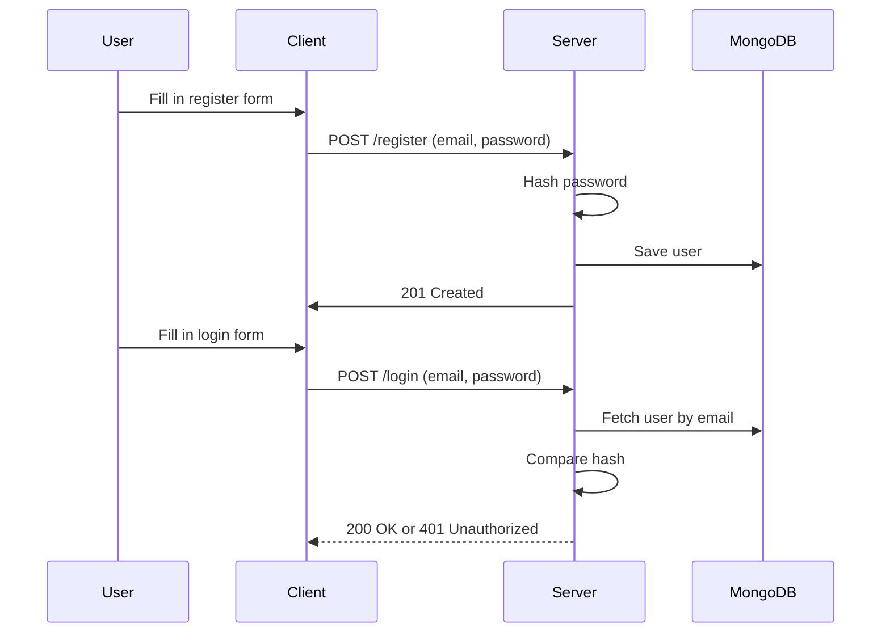

# auth-api

Simple authentication API built with Express and MongoDB to understand how user auth, password hashing, and backend API structure works.

## 🔧 Stack

- Node.js + Express
- MongoDB + Mongoose
- bcrypt
- dotenv
- nodemon (dev)

## 🎯 Features

- [x] POST /register
  - Create user with hashed password
  - Prevent duplicate accounts
- [x] POST /login
  - Compare password with stored hash
  - Return success or failure
- [ ] JWT token generation (later)
- [ ] Email verification flow (optional)
- [ ] Rate limiting, brute-force protection (stretch goal)

## 📁 Folder Structure

See `src/` directory for logical breakdown:

- routes → API endpoints
- controllers → logic handlers
- models → DB schemas
- utils → shared functions (e.g. hashing)

### 🧱 1. Project Structure — What Everything Means

#### 🔹 `src/index.ts`

> This is the main entry point. Usually sets up express and imports server.ts

#### 🔹 `src/server.ts`

> Sets up Express app instance, middleware, routes

Why separate from `index.ts`?
-> Because in tests, you might want to import the app **without starting it.**

#### 🔹 `src/routes`

> Handle URL endpoints. Maps HTTP methods (GET, POST, etc.) to controller logic.

#### 🔹 `src/controllers`

> Contains logic for each endpoint.
> Should be dumb -> just handles the requests & passes it to the service.

#### 🔹 `src/services`

> Business logic lives here: hashing, user lookup, etc.
> Keeps your controller thin. Testable, reusable, and maintainable.

#### 🔹 `src/models`

> Mongoose schemas = structure of MongoDB collections.

#### 🔹 `src/middleware`

> Functions that run before the controller.
> Example: check if email exists, validate input, check auth token.

#### 🔹 `src/utils`

> Helper logic like hash.ts to wrap `bcrypt.hash()` and `bcrypt.compare()`

#### 🔹 `src/config`

> DB connection, env variables, future logging config.
> Example: `config/db.ts` contains `mongoose.connect(process.env.MONGO_URI)`

## 📐 System Flow

